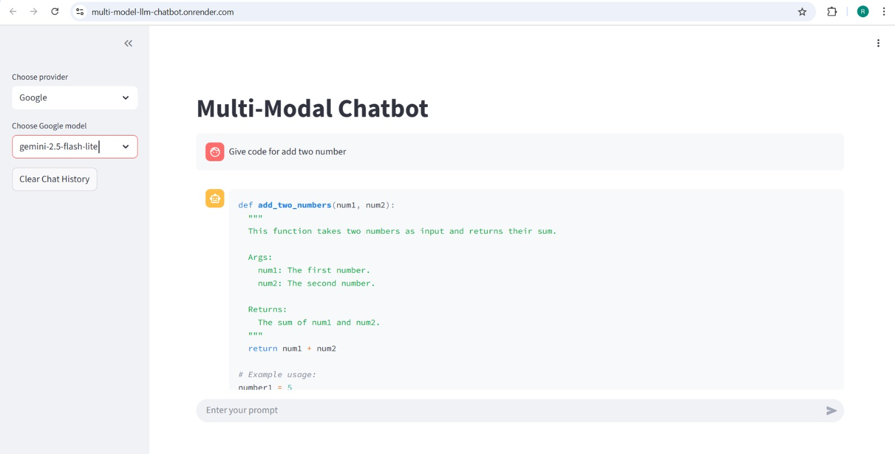
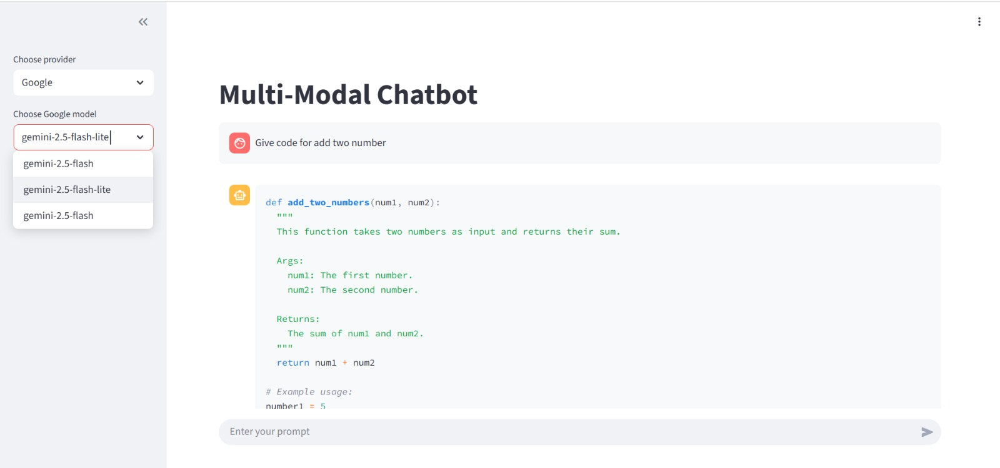
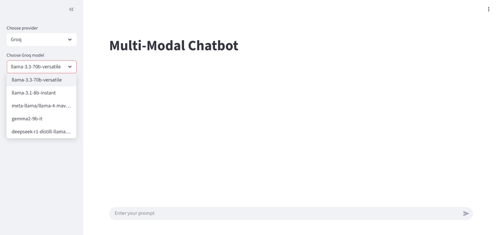

# Multi-Modal Chatbot with LangChain, Google Gemini, and Groq



## Overview

This project is a professional, extensible chatbot application built using [LangChain](https://github.com/langchain-ai/langchain), [FastAPI](https://fastapi.tiangolo.com/), and [Streamlit](https://streamlit.io/). It supports multiple LLM providers (Google Gemini and Groq) and allows users to select from available models for each provider.

## Supported Models

**Google Gemini:**
- gemini-1.0-pro
- gemini-1.5-pro
- gemini-1.5-flash
- gemini-2.5-flash

**Groq:**
- llama-2-70b
- llama-3-8b
- llama-3-70b
- llama-3-3-70b-versatile
- mixtral-8x7b
- gemma-7b

## Features

- **Multi-provider support:** Choose between Google Gemini and Groq models.
- **Dynamic model selection:** Models are fetched from the backend and selectable in the UI.
- **Robust error handling:** Graceful handling of API/model errors.
- **Modern UI:** Built with Streamlit for fast prototyping and deployment.
- **Extensible backend:** Easily add more providers or models.

## Architecture

- **Backend (`server.py`):**
  - FastAPI server exposes endpoints for chat and model listing.
  - Uses LangChain to orchestrate prompt and model invocation.
  - Dynamically selects models based on client requests.

- **Frontend (`client.py`):**
  - Streamlit app for user interaction.
  - Fetches available models from the backend.
  - Lets users select provider and model, enter a prompt, and view responses.

## Setup

1. **Clone the repository:**
   ```bash
   git clone https://github.com/yourusername/chatbot-langchain_Serve.git
   cd chatbot-langchain_Serve
   ```

2. **Install dependencies:**
   ```bash
   pip install -r requirements.txt
   ```

3. **Set environment variables:**
   - Create a `.env` file with your API keys:
     ```
     GOOGLE_API_KEY=your_google_api_key
     GROQ_API_KEY=your_groq_api_key
     ```

4. **Run the backend server:**
   ```bash
   python server.py
   ```

5. **Run the Streamlit client:**
   ```bash
   streamlit run client.py
   ```

## Usage

- Open the Streamlit UI in your browser.
- Select a provider (Google or Groq).
- Choose a model from the dropdown.
- Enter your prompt and view the response.

## Example Client UI

<p align="center">
  
  
</p>

## Extending

- To add more providers or models, update the model lists and backend logic in `server.py`.
- For custom prompts or chains, modify the prompt template.


